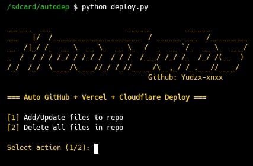

# 🌙 MoonLabs Deployment  
Automated GitHub + Vercel + Cloudflare Deployment

<p align="center">
  
</p>

---

## 🚀 Features
- Auto push files to GitHub
- Auto deploy to Vercel
- Auto deploy to Cloudflare Pages
- Simple CLI interface
- Supports Termux & Linux

---

## 📌 Preparation 
Before running the script, make sure you have:
- GitHub account
- GitHub token
- Vercel account (Optional if you only want to push to GitHub)
- Cloudflare API token (Optional)
- Python 3.x installed

---

# 📱 Installation & Usage

## **Termux**
```bash
pkg update && pkg upgrade
pkg install git
git clone https://github.com/Yudzx-xnxx/MoonLabs-Deployment.git
pkg install python3
cd MoonLabs-Deployment
pkg install pip
pip install -r requirements.txt
python3 deploy.py

```

---

## Linux (Ubuntu / Debian / Arch / Fedora)

```bash
sudo apt update && sudo apt upgrade
sudo apt install git python3 python3-pip -y
git clone https://github.com/Yudzx-xnxx/MoonLabs-Deployment.git
cd MoonLabs-Deployment
pip3 install -r requirements.txt
python3 deploy.py

```
### For Arch Linux:

```bash
sudo pacman -Syu git python python-pip

```
### For Fedora:

```bash
sudo dnf install git python3 python3-pip

```

---

## 🔧 Git Configuration

If this is your first time using Git on this device:

```bash
git config --global user.email "you@example.com"
git config --global user.name "YourName"

```

---

## ▶️ Running the Program

Run the script using:

python3 deploy.py

Then follow the menu instructions.


---

## ⭐ Support

If you like this project, don't forget to ⭐ it on GitHub!

---